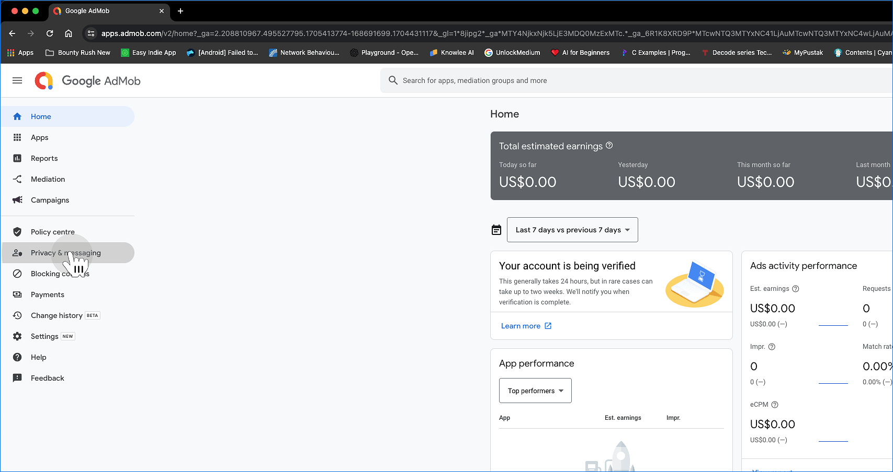
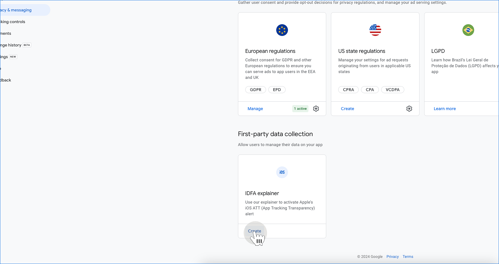
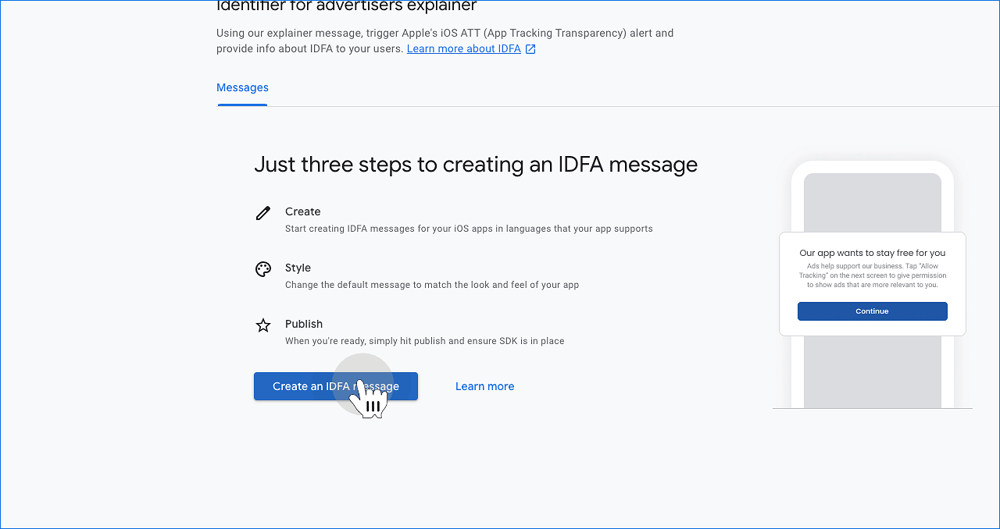
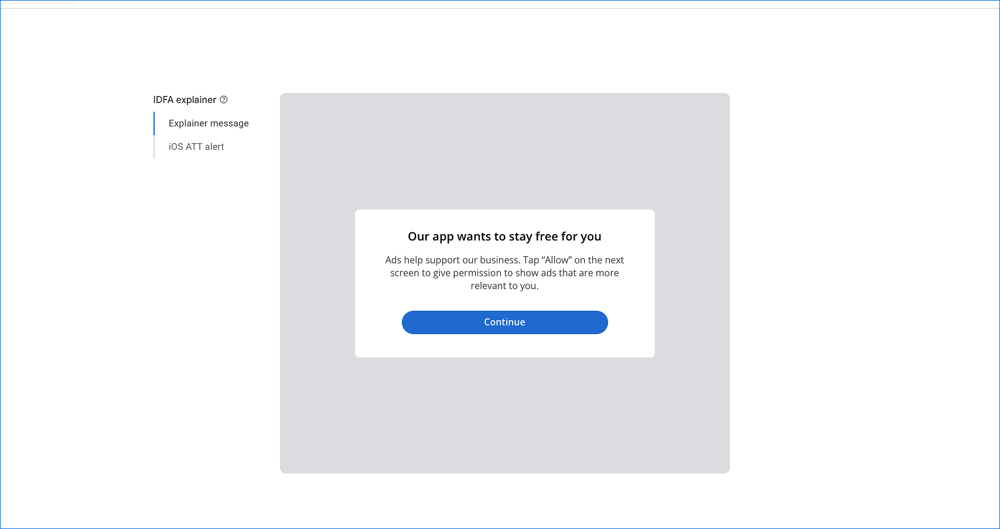
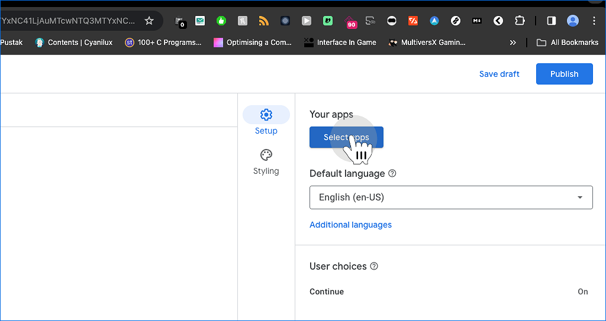
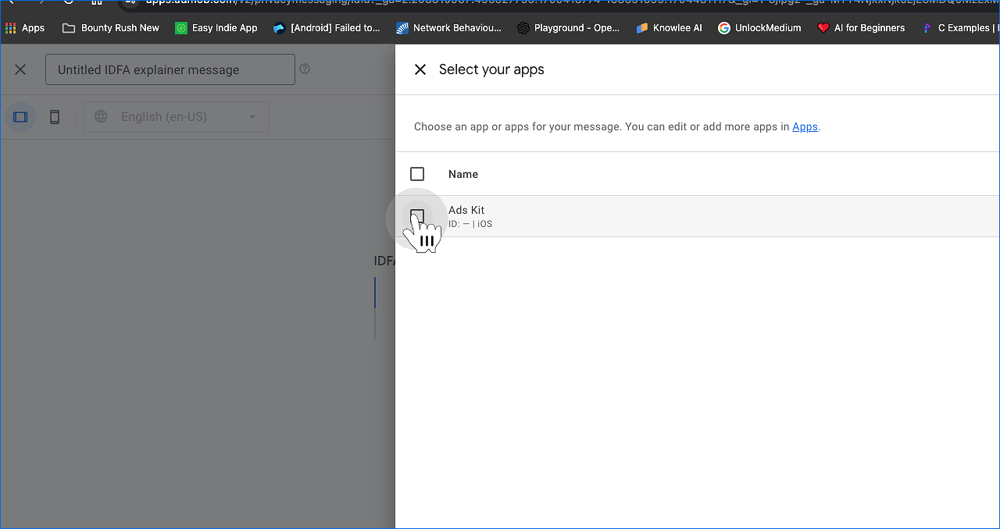
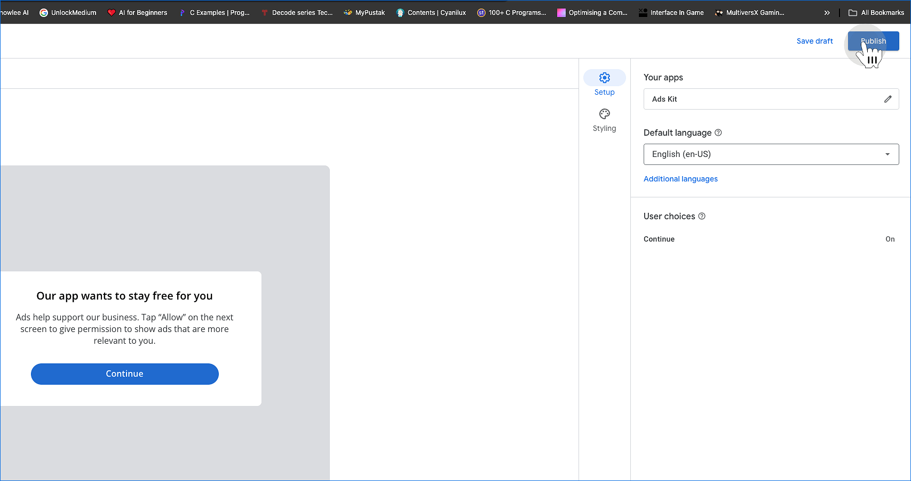
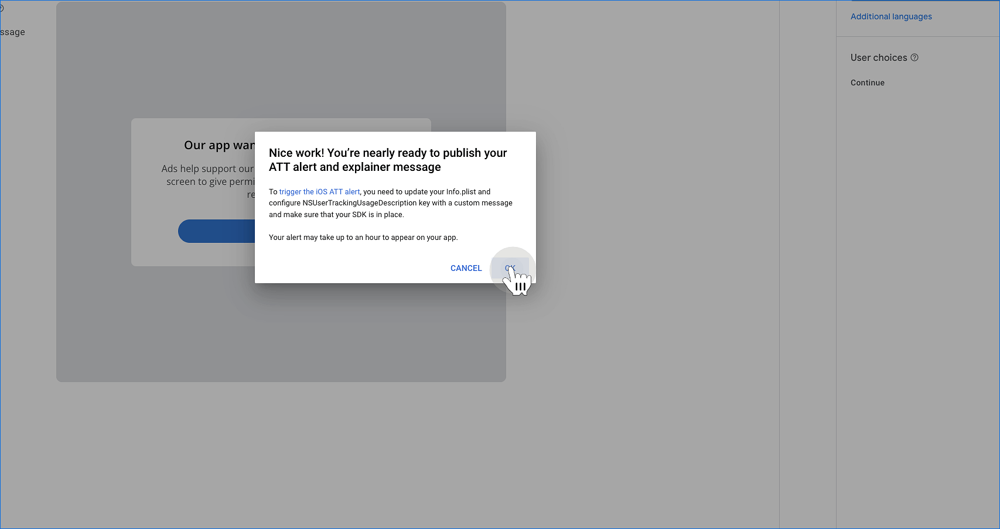
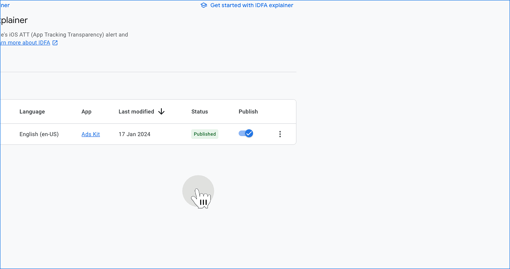

# Activate ATT on iOS

## Overview
1. Click on Privacy & Messaging
2. Click on IDFA Explainer
3. Click on "Get Started"
4. Click "Create an IDFA message"
5. Edit message as per your choice
6. Click Setup -> Select Apps
7. Select your iOS App
8. Click "Publish"
9. Click "Ok"
10. Check "Publish" status

### 1. Click on Privacy & Messaging
In Ad Mob dashboard, click on privacy and messaging tab.

### 2. Click on IDFA Explainer

### 3. Click on "Get Started"

### 4. Click "Create an IDFA message"

### 5. Edit message as per your choice

### 6. Click Setup -> Select Apps

### 7. Select your iOS App

### 8. Click "Publish"

### 9. Click "Ok"

### 10. Check "Publish" status

